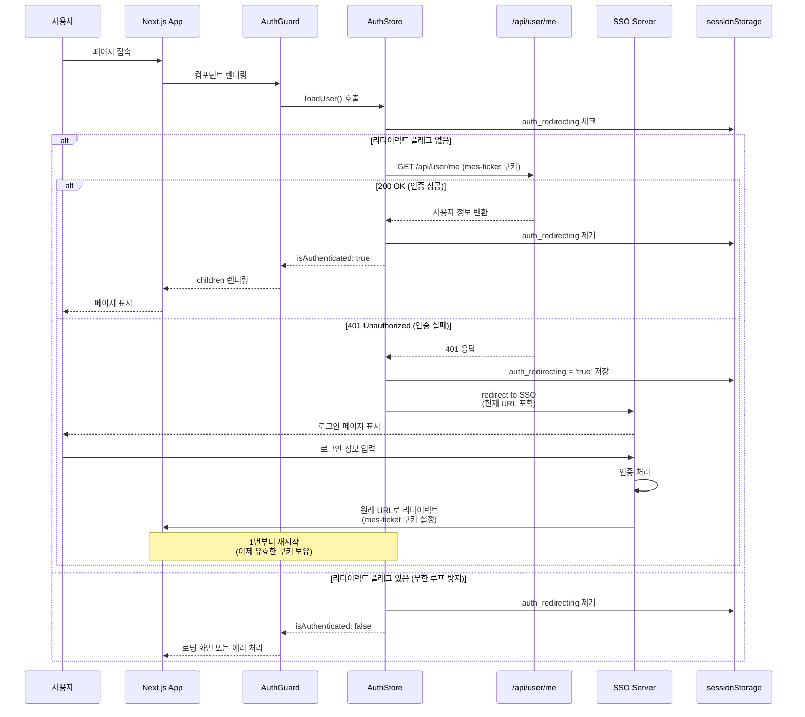
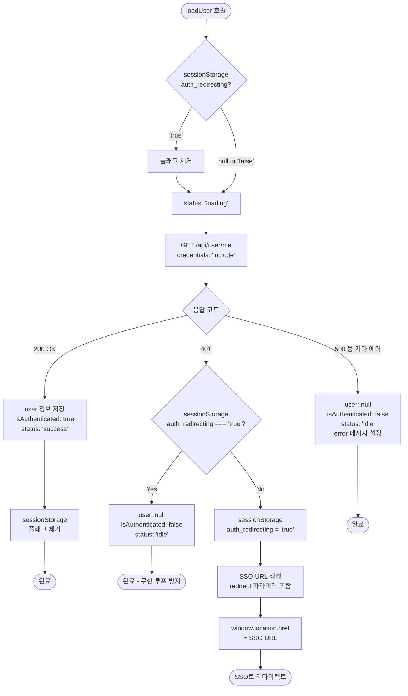
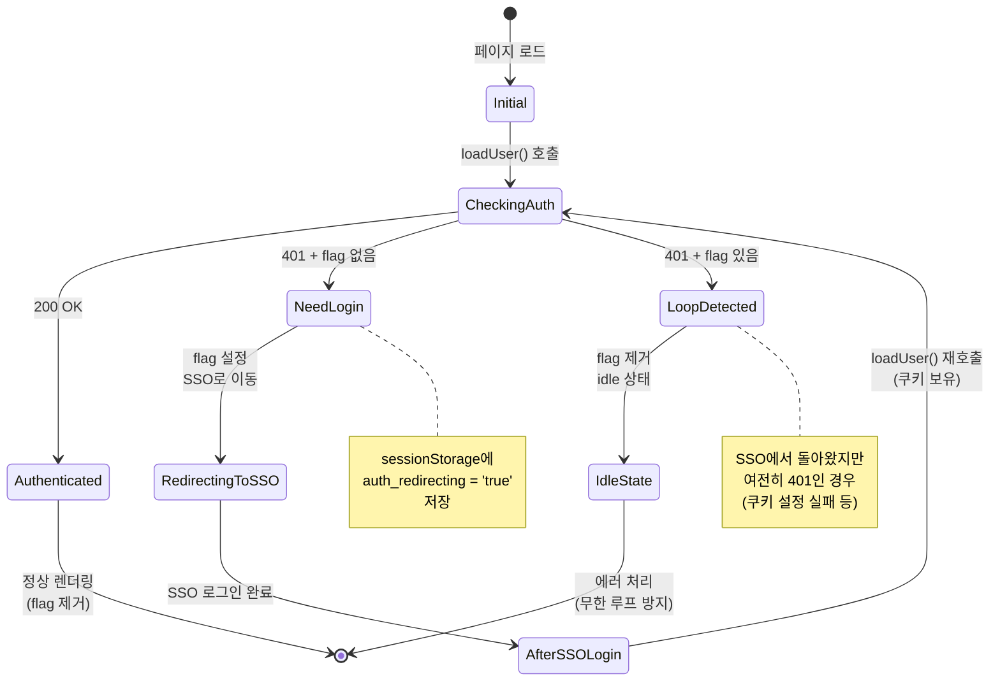
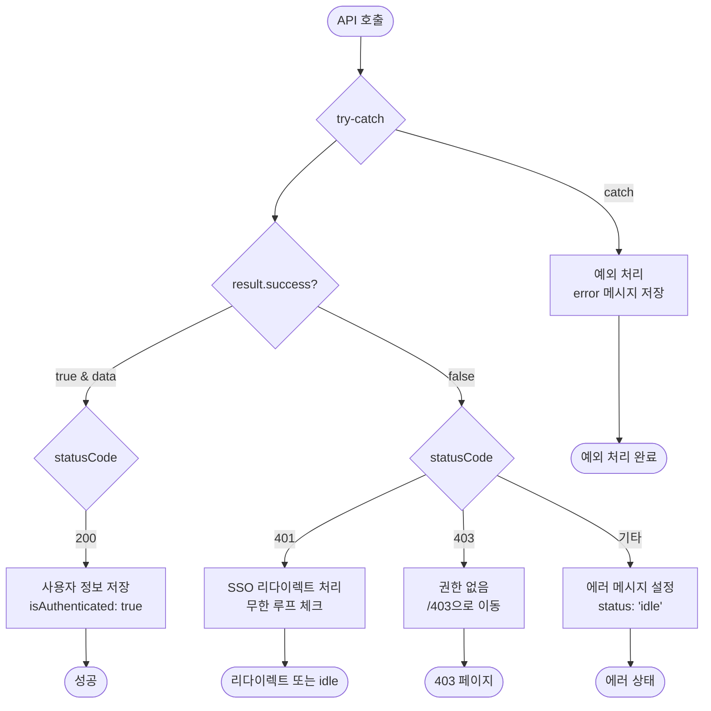
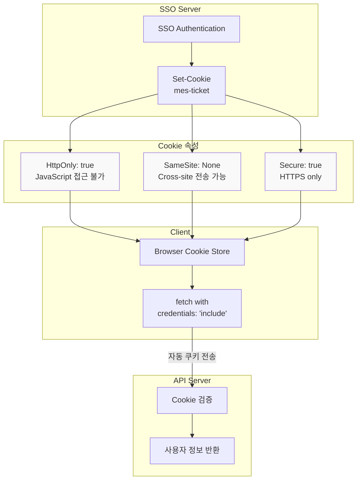

# SSO 쿠키 기반 인증 플로우 다이어그램

## 1. 전체 인증 플로우



## 2. 라우트 보호 로직

```mermaid
flowchart TD
    Start([페이지 접근]) --> AuthGuard{AuthGuard 체크}
    AuthGuard --> Loading{status === 'loading'?}

    Loading -->|Yes| ShowLoading[로딩 스피너 표시]
    Loading -->|No| CheckRoute{라우트 타입 체크}

    CheckRoute --> IsPublic{PUBLIC_ROUTES?<br/>/404, /403}
    IsPublic -->|Yes| AllowAccess[접근 허용]

    IsPublic -->|No| IsAdmin{ADMIN_ROUTES?<br/>/admin}
    IsAdmin -->|Yes| CheckAuth{isAuthenticated?}

    CheckAuth -->|No| WaitSSO[SSO 리다이렉트 대기]
    CheckAuth -->|Yes| CheckRole{role === 'admin'?}

    CheckRole -->|Yes| AllowAccess
    CheckRole -->|No| Redirect403[/403으로 리다이렉트]

    IsAdmin -->|No| IsPrivate{나머지 모든 페이지<br/>Private Route}
    IsPrivate --> CheckPrivateAuth{isAuthenticated?}

    CheckPrivateAuth -->|Yes| AllowAccess
    CheckPrivateAuth -->|No| WaitSSO

    AllowAccess --> Render[children 렌더링]
```

## 3. loadUser() 내부 로직



## 4. 무한 리다이렉트 방지 메커니즘



## 5. 시스템 아키텍처

```mermaid
graph TB
    subgraph "Client Side (정적 배포)"
        Browser[Browser]

        subgraph "Next.js App"
            Layout[app/layout.tsx]
            Pages[Pages]
            AuthGuard[AuthGuard Component]
            AuthStore[AuthStore - Zustand]
            API_Client[apiClient]
        end

        subgraph "Storage"
            SessionStorage[sessionStorage<br/>auth_redirecting flag]
            Cookie[HttpOnly Cookie<br/>mes-ticket]
        end
    end

    subgraph "Server Side"
        API[/api/user/me]
        SSO_Server[SSO Server<br/>sso.cowexa.com]
    end

    Browser --> Layout
    Layout --> AuthGuard
    AuthGuard --> AuthStore
    AuthStore --> API_Client
    API_Client --> API

    AuthStore <-.-> SessionStorage
    API_Client <-.-> Cookie

    API -->|401| AuthStore
    AuthStore -->|Redirect| SSO_Server
    SSO_Server -->|Set Cookie| Cookie
    SSO_Server -->|Redirect Back| Browser

    API -->|200 + User Info| AuthStore
    AuthStore --> AuthGuard
    AuthGuard --> Pages
```

## 6. 데이터 흐름

```mermaid
flowchart LR
    subgraph "인증 상태 저장소"
        Store[AuthStore - Zustand]
        State[State:<br/>user: User | null<br/>isAuthenticated: boolean<br/>status: AsyncState<br/>error: string | null]
    end

    subgraph "API 계층"
        API[auth/api.ts]
        Client[apiClient]
    end

    subgraph "컴포넌트 계층"
        Guard[AuthGuard]
        Hook[useAuthStore hook]
        Pages[Page Components]
    end

    subgraph "설정"
        Constants[constants.ts<br/>AUTH_CONFIG]
    end

    Guard -->|useAuthStore| Store
    Pages -->|useAuthStore| Store

    Store -->|loadUser| API
    API -->|apiClient.get| Client
    Client -->|HTTP GET| Server[/api/user/me]

    Server -->|Response| Client
    Client -->|ApiResponse| API
    API -->|Update State| Store

    Store -.->|Read Config| Constants
    API -.->|Read Config| Constants
```

## 7. 에러 처리 플로우



## 8. 쿠키 및 보안



## 주요 특징

### 정적 배포 지원
- 런타임 환경변수 대신 `constants.ts` 설정 파일 사용
- 빌드 시점에 모든 설정 고정
- 서버리스 환경에서도 동작

### 보안
- HttpOnly 쿠키로 XSS 공격 방지
- SSO 서버에서 중앙 집중식 인증 관리
- 프론트엔드에서 쿠키 직접 접근 불가

### 사용자 경험
- 무한 리다이렉트 방지 (sessionStorage 플래그)
- 로딩 상태 표시로 깜빡임 최소화
- 원래 페이지로 자동 복귀

### 확장성
- RBAC 지원 (admin 권한 체크)
- 라우트별 접근 제어
- Zustand를 통한 전역 상태 관리
